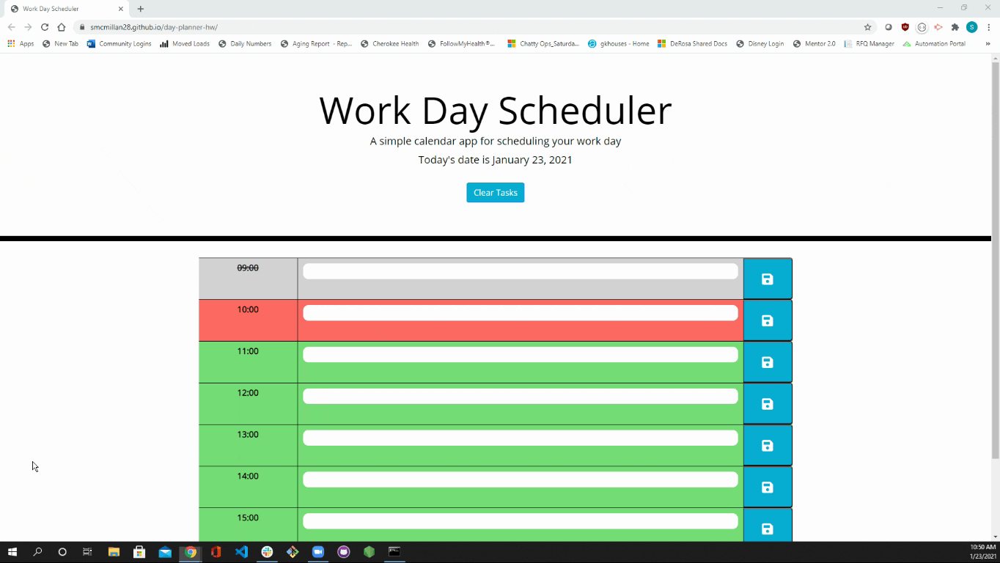

# Workday Planner
Everyone has a busy life.  Time management and prioritization are important skills to master as we navigate the day, both personally and professionally.   

This basic, easy-to-use workday planner will help you keep track of your hourly tasks and take you one step closer to mastering time management.  Check it out [here](https://smcmillan28.github.io/day-planner-hw/) and read the guide below for additional explanation!

## Table of Contents

[Planner Functionality](#planner-functionality)\
[Visual Representation](#visual-representation)\
[Code Used and Credits](#code-used-and-credits)\
[Project Takeaways](#project-takeaways)

## Planner Functionality
When you open the page, you will be presented with a nine-hour calendar for the current day, starting at 0900 and ending at 1700 (using 24-hour format).  Within each hour block, there is a form to enter a task.  You can type anything you'd like here to block off the entire hour.  

Once you've entered a task, just click the button to the right to save that task to the hour!  If you made a mistake, or if something more important comes up, that's okay.  Just re-write your task for that hour and click save again!  You can only save one (1) task per hour.  I know this may seem limiting, but it will help you focus on that one task and will make sure you're prioritizing tasks accordingly.  

If the hour has already passed, you will still be able to enter a task.  However, the text will have a STRIKETHROUGH line.  Unless your name is Marty McFly, you can't perform tasks in the past.  As you go about your day and need to leave your computer, just close out of your browser and return when you need to reference the calendar again.  Tasks will be saved in your browser's local storage. 

When a new day starts, or when you're ready to clear the calendar, just click the "CLEAR TASKS" button at the top of the page!  You're ready to start planning.  

## Visual Representation

The following animation demonstrates the application functionality:

## Code Used and Credits

- HTML/CSS
- JavaScript/jQuery
- [Bootstrap](https://getbootstrap.com/)
- [Moment.js](https://momentjs.com/)
- [Font Awesome](https://fontawesome.com/)

## Project Takeaways

Continuing to build on the skills we're learning each week, this project focused on writing dynamic jQuery DOM manipulation functions to create the contents of our page, incorporating third party APIs into our code (Moment.js), and storing/rendering items from local storage.  

Fortunately, there was a significant chunk of starter code for us to use, so knowing when/how to apply pre-defined classes through conditional statements was an important part of this project.  That being said, I did make a few CSS changes to add to the page's style and functionality.  

Three primary takeaways:
- Reading API documentation and learning how to use/navigate code you didn't write is very important
- jQuery is much more intuitive than barebones JavaScript, particularly for event handlers and element selectors
- Continuing to work on learning the importance of local storage and how to access